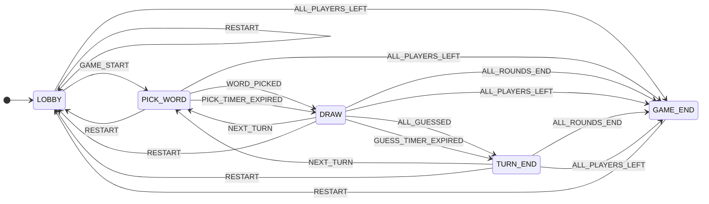
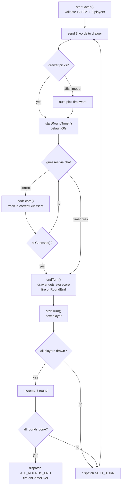

# Skribl

A multiplayer drawing and guessing game.One person draws,everyone else tries to guess the word in the chat.Built from scratch with socket.io and a state machine on the backend.No frameworks on the frontend, just vanilla HTML canvas and JS.

This is only the phase 1. The full game loop works, you can create rooms, draw,guess,score points,and play through multiple rounds. It is not production ready.There is no reconnection handling,no Redis, no horizontal scaling.That is all planned for later phases.

## how it works, roughly

The server is a single Node.js process.When someone creates a room,the server generates a 4 character code and creates an in memory `gameRoom` object.Other players join by entering that code.All communication happens over web socket via socket.io .

Once the host starts the game,the server walks through a state machine: pick a word,draw,end the turn,pick the next drawer, repeat.When all rounds are done, it shows a final scoreboard and the room goes idle.

There is no database. Everything lives in memory. If the server restarts,all rooms are gone.

## the state machine

The game is driven by a finite state machine defined in `gameStateMachine.ts`. These are five states.

- **LOBBY** -- waiting for players,host can configure settings
- **PICK_WORD** -- the current drawer is choosing from three random words
- **DRAW** -- active round,drawer draws on the canvas,everyone else guesses in chat
- **TURN_END** -- round just finished,scores are shown
- **GAME_END** -- all rounds are done,final scoreboard

Every transition is defined in a table.The table is exhaustive.every combination of (state,event) maps to either a valid next state or `"IGNORE"`. There are no implicit transitions and no ad hoc boolean flags.The state machine is the single source of truth for what the game is doing.



Any event that does not appear in this diagram for a given state is mapped to `IGNORE`, which means the machine stays in its current state and logs a warning. This was a deliberate choice to prevent the server from crashing on stale or out of order events.Before this was added, race conditions between clients would occasionally throw and take down the whole process.

The `GameStateMachine` class wraps this table and exposes a `dispatch(event)` method that returns the new state. The `gameRoom` calls `dispatch` at every transition point.

## some tradeoff

### Why the matrix and not XState/state Pattern

There are other standard ways to do this.XState is one of the ways in the JS ecosystem it will give me a full FSM library with visualizers, guards etc The State Pattern (each state is its own class with `onEnter`/`onExit` hooks) is the also a valid OOP approach.

I went with the flat matrix because my current setup has 5 states and nearly ~9 events. So total of 5*9=45 entries. XState is a serious dependency with its own learning curve, and for a game this small it would be an overkill ,at least for now. The State Pattern would work fine, but it scatters my transitions across multiple class files but I wanted one table where I can see every possible transition all at once. When something breaks, I open one file and fix it.

I am aware that the matrix does not scale well. If this game had 50 states and 100 events, the table would be 5,000 entries of mostly `IGNORE` and I would probably reach for XState or the State Pattern or something else instead. But at this size, the tradeoff is worth it because of 0 dependencies, full compile time coverage, and the entire game flow fits in one file.

### Socket.IO vs Raw WebSockets

Why use socketio instead of native websocket which is extremely lightweight and fast.

I chose socket primarily because its built in rooms are useful out of the box. It natively supports putting connections into "rooms" (`socket.join('room-code')`) and broadcasting to them (`io.to('room-code').emit()`). This alone saved hundreds of lines of boilerplate for managing arrays of players per room.

With raw 'ws' i would have to write everything myself. I would have to write my own my own room management system,and your own reconnection logic on the client. For a room based multiplayer game like this,the slightly heavier overhead of sockettio is worth the massive reduction.

## running it

```bash
npm install
npm run dev:server
npm run dev:client
```

 For two player testing, open two browser tabs at `http://localhost:3001` create a room in one,and join with the code in the other.


## Project structure

```
skribl/
  server/
    src/
      index.ts                    # entry point,express socket.io setup
      game/
        gameRoom.ts               # the room class,holds all game state
        gameStateMachine.ts       # explicit state machine
        player.ts                 # player interface
        wordBank.ts               # word selection, hints, scoring, 
        roomManager.ts            # singleton that tracks all rooms+socket to room map
      socket/
        handlers/
          roomHandler.ts          # room:create,room:join,room:leave
          gameHandler.ts          # game:start, word selection,stroke broadcasting
          chatHandler.ts          # chat messages,guess checking
    words.json                    # the word list
  client/
    index.html
    css/styles.css
    js/
      app.js,socket.js,canvas.js,chat.js,lobby.js, game.js
  package.json
  tsconfig.json
  nodemon.json
```

---

## Backend

### GameRoom

`gameRoom.ts` is the core class. One instance per active room.It holds the player list (`{id, socketId, name, score}`),the current word,the state machine instance, a `setTimeout`based timer, round tracking (current round, max rounds, drawer index), a `Set<string>` of correct guessers this turn ,and a running score total for calculating the drawer bonus.

The room exposes callback hooks namely`onRoundEnd`,`onTurnStart`,`onGameOver` that the socket handlers wire up when the room is created. This keeps the room class itself free of socket.io. The room does not know about sockets or emit anything. It just calls the callbacks and the handlers take care of emitting.

**Round flow**:



on player disconnect, `endTurn(true)` decrements the player index instead of incrementing so the turn order does not skip anyone.

### RoomManager

singleton class in `roomManager.ts`.It has two maps:

- `map<string,gameRoom>`=>room code to room instance
- `map<string,string>`=>socket ID to room code

Thats it.It creates rooms, looks them up, destroys them, and tracks which socket belongs to which room. The socket to room map is used on disconnect to figure out which room a socket was in without having to search through every room.

Exported as a singleton instance (`export default new RoomManager()`), so all handlers share the same state.

### WordBank

Static utility class:

- `getRandomWords(n)` — picks n random words from `words.json`
- `getBlankHint(word)` — returns `_ _ _ _ _` format
- `getProgressiveHint(word,revealCount)` — reveals random letters
- `calculateScore(timeElapsed,totalTime)` — the scoring formula
- `checkWordMatch(guess,target,timeElapsed)` — returns matchtype(exact,close,none) and score

### Socket handlers

Three handler files:

| File | Events | Key behavior |
|------|--------|-------------|
| **roomHandler.ts** | `room-create`, `room-join`, `room-leave` | creates rooms,adds players,wires callbacks,destroys on host leave |
| **gameHandler.ts** | `game-start`, `word-choosen`, `stroke` | starts game,handles word pick,relays drawing data |
| **chatHandler.ts** | `chat-message` | blocks drawer,checks guesses (exact/close/none),broadcasts |

### Disconnect handling

When a player disconnects(browser close,network drop):

1. server finds their room via `socketMap`
2. removes player from room
3. calls `endTurn(true)` which decrements the player counter
4. if the disconnected player was the host it emits `game-over` and destroys the room
5. If room is empty it destroys the room

This is the Phase 1 approach. Not good, just gets the loop working, host leaving kills the entire game. Phase 2 will add host transfer and a 15-second reconnection grace period.

### Scoring details

```
Guesser score=max(100,500-(timeTaken/totalTime)*400)
  → first guesser gets more points than the late guessers

Drawer score=sum(guesserScores)/numGuessers
  → drawer is incentivized to draw well
```

### Canvas sync

Dont send pixels instead send strokes as vector data:

```typescript
interface Stroke {
  points: { x: number; y: number }[];//the points are normalised bw 0-1
  color: string;
  width: number;
  isEraser: boolean;
}
```

### Events reference

| Direction | Event | What it does |
|-----------|-------|-------------|
| C to S | `room-create` | create a new room with host|
| C to S | `room-join` | join an existing room by code |
| C to S | `room-leave` | leave the current room |
| S to C | `room-joined` | full room state sent on join |
| S to C | `player-joined` | broadcast when someone joins |
| S to C | `player-left` | broadcast when someone leaves |
| C to S | `game-start` | host starts the game |
| S to C | `game-started` | broadcast that game has begun |
| S to C | `choose-word` | 3 words sent to the drawer |
| C to S | `word-choosen` | drawer picked a word |
| S to C | `round-started` | round begins, includes word hint, drawer id, timer |
| C to S | `stroke` | drawing data from the drawer |
| S to C | `stroke-draw` / `stroke-clear` / `stroke-fill` | relayed drawing data |
| C to S | `chat-message` | player sends a guess or chat |
| S to C | `chat-message` | broadcast chat or system message |
| S to C | `round-end` | round over,reveals word and scores |
| S to C | `game:over` | game finished,final scores |

---

## Frontend

The frontend is deliberately simple. Vanilla html, css, and js. No react for now.The point of this project is the backend, not the UI. Maybe i will shift the frontend to react after phase 2 or 3 is done. If i shift to react then the folder strucutre of frontend will also be made better.

```
client/
├── index.html
├── css/styles.css
└── js/
    ├── app.js        # entry point,routing,theme toggle
    ├── socket.js     # socket io wrapper with event dispatcher
    ├── canvas.js     # drawing tools, stroke replay, remote sync
    ├── chat.js       # chat message rendering
    ├── lobby.js      # player list,settings,start game
    └── game.js       # imer,hints,overlays,scores
```

The styling has an arcade aesthetic

---

## What things are done right now (both)

- creating and joining rooms with 4 character codes
- lobby with configurable rounds, draw time, and max players
- host only game start (needs at least 2 players)
- word selection screen with a 15 second auto pick timer
- real time canvas drawing synced across all players
- drawing tools => colors, brush sizes, eraser, undo, clear, fill
- chat based guessing with exact match detection
- close guess detection (Levenshtein distance) with private feedback
- time based scoring with drawer bonus
- multi round flow with automatic turn rotation
- round end overlay showing the word and score deltas
- final scoreboard with podium display
- host disconnect ends the game for everyone

## What is not done yet (both)

These are Phase 2 and beyond. I have not started on any of them

- Reconnection handling(if you disconnect, you are out)
- host transfer when the host leaves
- progressive hint reveals during the round
- Player joining mid game
- redis adapter for multi server deployment
- Structured logging
- metrics
- docker setup
- load testing

## Known shortcomings

- The `hostId` on the room is set to the socket ID of the creator, but player IDs are random strings. This works because host checks compare against `socket.id`, but it is a bit inconsistent.
- Player IDs are generated client-side with `Math.random()`,which is fine for Phase 1 but obviously not secure or collision-resistant.
- The word list is only 50 words.You will see repeats in longer sessions.
- `word-choosen` is misspelled everywhere.It is consistent,so it works,but I am aware of it.
- Drawer score calculation divides by total potential guessers (players - 1), not just the number who actually guessed.This means if only 1 out of 7 people guess, the drawer gets a low average.

## Tech stack (both)

- nodejs+express+TS(backend)
- socket io(websockets)
- Vanilla HTML/CSS/JS(frontend)
- html canvas(drawing)
- in memory Map
